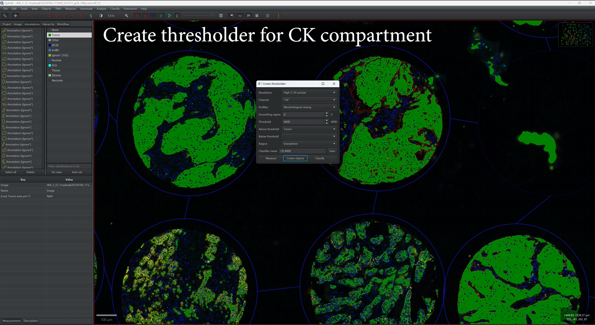
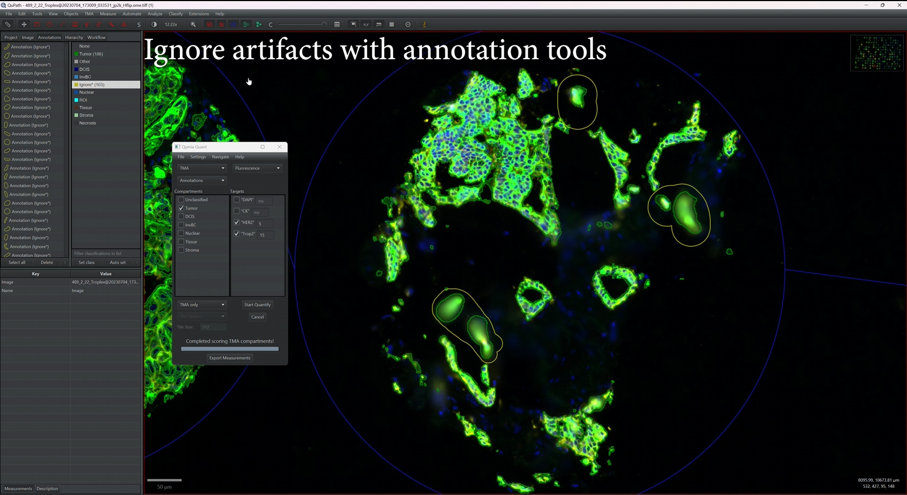
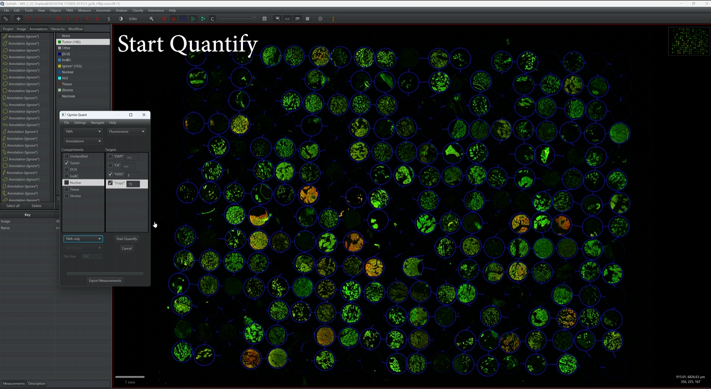

# Qymia in QuPath

 

### **Quantitative Immunofluorescence and Immunohistochemistry Molecular Image Analysis (Qymia)**

Fast, high-throughput quantification of multiplex immunofluorescence or immunohistochemistry staining in clinical specimens (tissue microarrays, whole tissue sections) by molecular compartmentalization techniques in QuPath.

## Installation
1. Download compatible Qymia release from [Releases](https://github.com/snibbor/Qymia-in-QuPath/releases)
2. Unzip and drag .jar into QuPath

## Usage
1. Create compartments (annotations or detections) inside of QuPath
2. Run **Qymia Quant** to quantify target biomarker expression within compartments

## Workflow Demo:

This workflow uses QuPath’s built-in SimpleThresholder and Qymia Quant. See the full guide in [docs/Qymia-workflow-example-guide.pdf](docs/Qymia-workflow-example-guide.pdf).

### 1) Thresholding TMA with PixelClassifiers

### 3) Quantifying Expression
 

## References:
- Dr. David Rimm's Laboratory at Yale School of Medicine (https://medicine.yale.edu/lab/rimm/)
- Camp RL, Dolled-Filhart M, King BL, Rimm DL. Quantitative analysis of breast cancer tissue microarrays shows that both high and normal levels of HER2 expression are associated with poor outcome. Cancer Res. 2003 Apr 1;63(7):1445-8. PMID: 12670887.
- McCabe A, Dolled-Filhart M, Camp RL, Rimm DL. Automated quantitative analysis (AQUA) of in situ protein expression, antibody concentration, and prognosis. J Natl Cancer Inst. 2005 Dec 21;97(24):1808-15. doi: 10.1093/jnci/dji427. PMID: 16368942.
